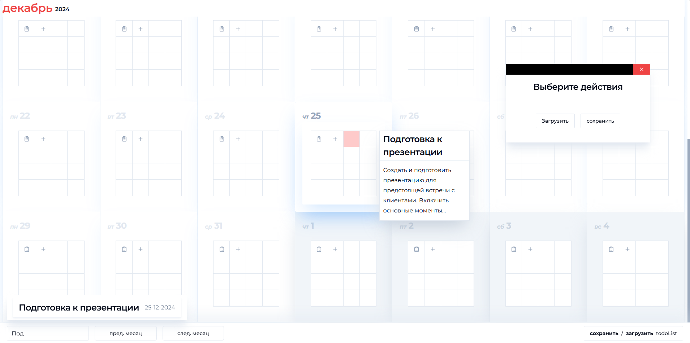

### React+Tailwind+Mobx
TodoList в виде календаря.
Возможность:
1. Каждый месяц самостоятельно генерируется
2. Возможность создавать задачи и подзадачи
3. Возможность искать задачи по заголовкам
4. Возможность сохранять todoList на пк , и загружать с пк.

